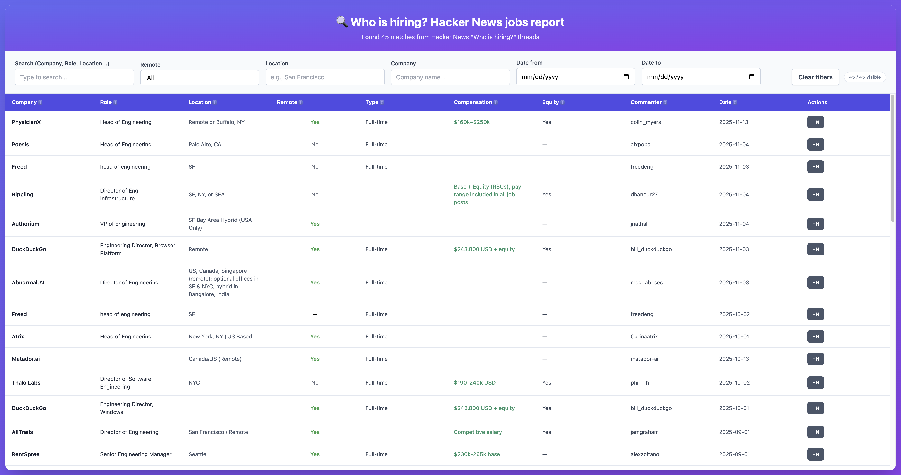

# HN "Who Is Hiring?" Report Generator

Fully vibe-coded script to pull recent Hacker News "Who is hiring?" threads, scrape comments, find all comments mentioning a particular role, and produce an interactive HTML report.

## Report preview


## Quick start
- Zero-thinking copy/paste (creates venv, installs deps, runs pipeline with default engineering management profile):
  ```bash
  python3 -m venv .venv
  source .venv/bin/activate
  pip install -r requirements.txt
  make all PROFILE=profiles/engineering_management.yaml
  ```
- Swap profiles without clobbering others:
  ```bash
  make all PROFILE=profiles/ux_designer.yaml
  ```
- Adjust `MONTHS` to limit how far back to search. Outputs default to `out/` unless overridden.

## Run steps manually

1) Fetch post list (~N months back):
   ```bash
   python who_is_hiring.py --months 6 --output out/posts.json
   ```
2) Fetch comments for those posts:
   ```bash
   python who_is_hiring.py --fetch-comments --input out/posts.json --output out/comments.json
   ```
3) Search for roles (defaults to engineering management profile):
   ```bash
   python who_is_hiring.py --search --input out/comments.json --output out/engineering_management/matches.json
   ```
   - Add `--no-extract` to skip LLM usage entirely when searching.
4) Extract structured fields (title, location, remote, comp, etc.):
   ```bash
   python who_is_hiring.py --extract-from-matches --input out/engineering_management/matches.json --output out/engineering_management/matches_with_extraction.json
   ```
5) Generate the HTML report:
   ```bash
   python who_is_hiring.py --generate-html --input out/engineering_management/matches_with_extraction.json --output out/engineering_management/report.html
   ```
6) Utilities:
   - List available profiles: `make list-profiles`
   - See all flags: `python who_is_hiring.py -h`

## Profiles (what they are and how to create one)
- Profiles live in `profiles/*.yaml` and define regex patterns for the roles you want to catch (e.g., engineering management, UX/design).
- To add a profile:
  1) Copy an existing file in `profiles/` and rename it (e.g., `profiles/data_science.yaml`).
  2) Edit the `patterns:` list with your regexes and optional `name` fields.
  3) Run `make list-profiles` to confirm it’s picked up, then run the pipeline with `PROFILE=profiles/your_profile.yaml`.
- Regexes can be tricky; the fastest path is to describe your target roles/patterns to an AI coding assistant/agent and let it draft or refine the profile YAML for you, then review/tweak as needed.

## Notes
- `OPENAI_API_KEY` **must** be set (in your shell or a `.env` file) before running; if it’s missing, the script exits immediately with a clear error.
- Cached inputs (`out/posts.json`, `out/comments.json`, etc.) let you rerun later steps without re-scraping; the script now reuses them by default. Per-profile outputs land in `out/{profile_stem}/` to avoid clobbering other profiles.
- The script hits the HN Algolia API for post discovery and the official HN API for comments.

## Tests
- Basic end-to-end check (from a shell where the virtualenv and dependencies are set up):  
  ```bash
  python3 -m venv .venv
  source .venv/bin/activate
  pip install -r requirements.txt
  make test-e2e
  ```
